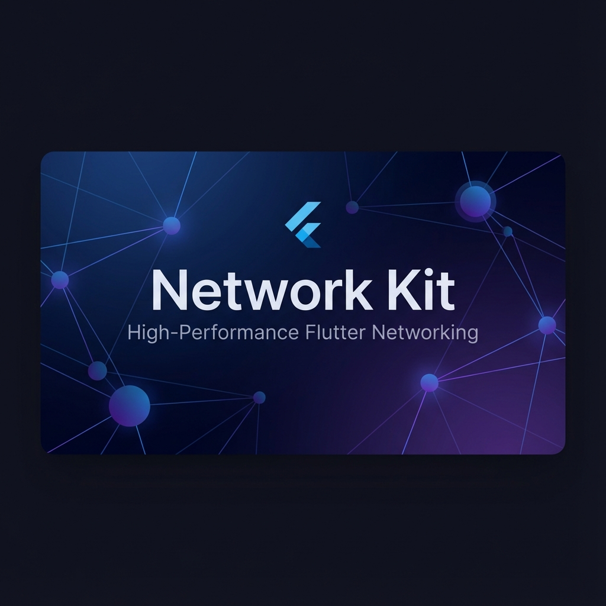
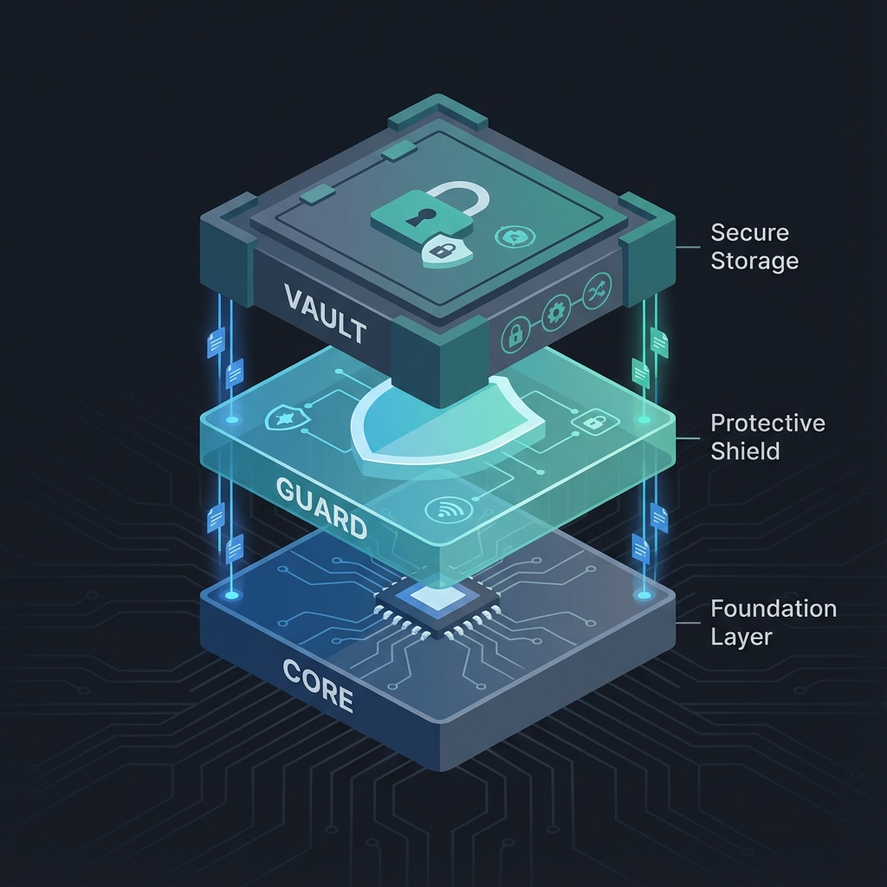

<p align="center">
  
</p>

# Network Kit 🚀

### Stop writing boilerplate. Start writing resilient apps.

Network Kit isn't just another wrapper around `dio`. It's a high-performance, opinionated networking engine designed to solve the three most annoying problems in Flutter development: **Janky UIs during heavy parsing**, **Messy try-catch error handling**, and **Data loss on intermittent connections.**

[](https://pub.dev/packages/network_kit)


---

## 🧐 Why Network Kit?

Most developers treat networking as a secondary concern. They throw a `dio.get()` in a repository and pray the wifi stays on. Network Kit treats connectivity as a **first-class citizen**.

- **🛡️ No More Exceptions**: We use Dart 3 Sealed Classes. You *must* handle both success and failure states. Your compiler becomes your QA.
- **⚡ Background Parsing is Default**: We believe the UI thread is for UI. All JSON decoding happens in background Isolates, automatically. No more frame drops.
- **📦 The "Magic" Offline Vault**: If a user submits a form in a tunnel, the request isn't lost. It's snapshotted, persisted, and replayed as soon as the signal returns.
- **🔄 Defensive Retries**: We don't just retry everything. We use exponential backoff exclusively for transient timeouts, so you don't spam your backend on logic errors.

---

## 🛠️ The Architecture

We built this package in three defensive layers, visualized below:

<p align="center">
  
</p>

1.  **The Core**: Native `dio` foundation with robust `SocketException` mapping.
2.  **The Guard**: Automatic Auth-injection and defensive retry interceptors.
3.  **The Vault**: The persistent FIFO queue that ensures your users' data survives app kills and signal drops.

[Read the Architecture Deep Dive →](docs/guides/architecture.md)

---

## 🚀 Speed Run

### 1. Installation
```yaml
dependencies:
  network_kit: ^0.0.1
```

### 2. Zero-Config Setup
```dart
final client = NetworkClient(
  baseUrl: 'https://api.app.com',
  storage: OfflineStorage(), // Optional: Enables the Vault
);

final syncManager = SyncManager(client);
syncManager.startMonitoring(); // Replays your queue automatically
```

### 3. Usage (The Functional Way)
```dart
final result = await client.request<Map>(path: '/post', method: HttpMethod.post);

switch (result) {
  case Success(data: final data):
    print('Success: $data');
  case Failure(statusCode: 499):
    print('Saved to offline vault!');
  case Failure(message: final err):
    print('Dead end: $err');
}
```

---

## 📄 License & Safety
- **MIT Licensed**: Open source and free for commercial use.
- **Safety First**: Implements a 200-item circular buffer for storage protection and batched I/O for battery efficiency.

[Getting Started Guide](docs/guides/getting_started.md) | [Report a Bug](https://github.com/mehdihassan93/network_kit/issues)
